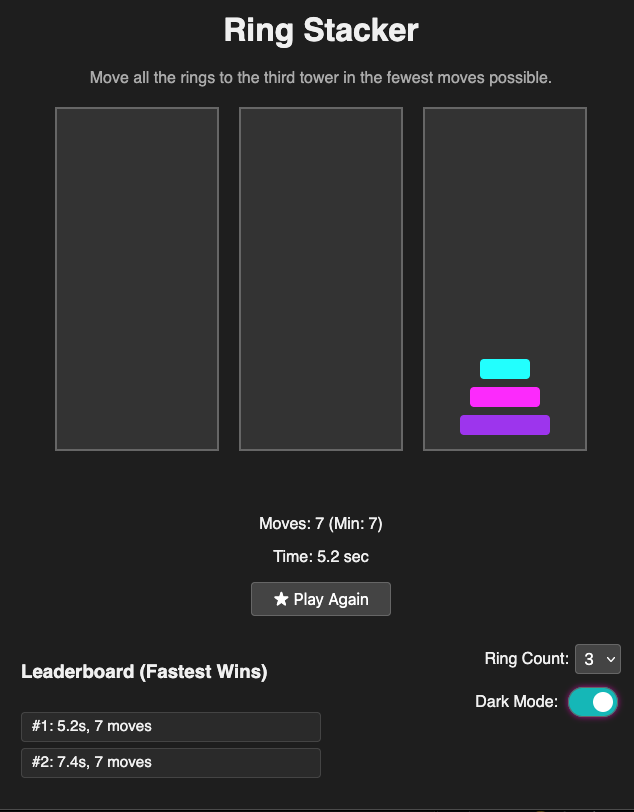

# 🎮 Ring Stacker

A colorful, neon-themed Tower of Hanoi puzzle game built with vanilla HTML, CSS, and JavaScript.

## 🔗 Play the Game

👉 [Play Live on GitHub Pages](https://your-username.github.io/ring-stacker)

## 🧠 How to Play

Move all the rings from the first tower to the third tower while following these rules:

- Only one ring can be moved at a time.
- Only the top ring of a tower can be moved.
- A ring can only be placed on an empty tower or on a larger ring.

Includes:
- 🎨 Synthwave-style neon rings
- 🎉 Confetti on win
- 🔈 Cheer sound
- 🌓 Dark mode toggle
- 🏆 Leaderboard (local storage)
- ⏱️ Move counter and timer

## 📦 Version

**v1.1** – Final

## 🛠️ Tech

- HTML
- CSS
- JavaScript (no libraries)
- Canvas Confetti
